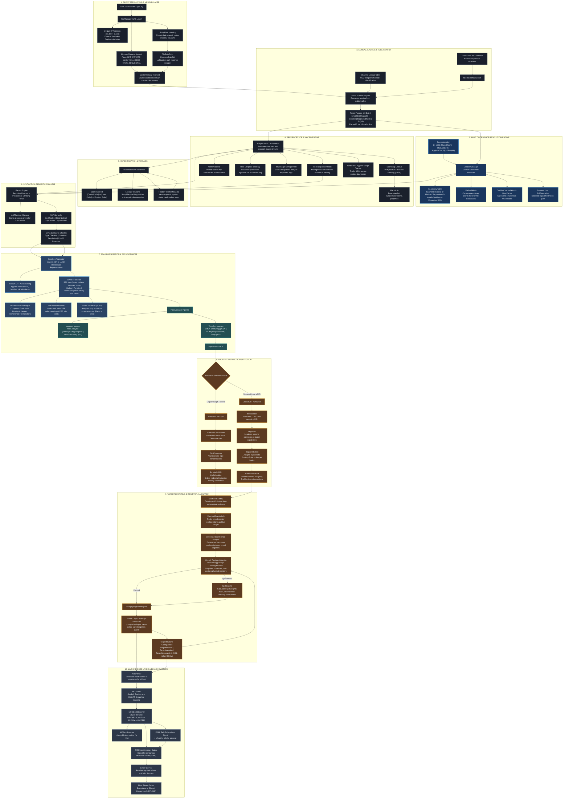

```mermaid
flowchart TD
  subgraph VFS_Mem ["1. FILE SYSTEM & STABLE MEMORY LAYER"]
    DiskFiles["Disk Source Files (.cpp, .h)"] --> FM["FileManager (VFS Layer)"]
    FM --> UID["UniqueID Validation (st_dev + st_ino)<br/>Detects Symlinks / Duplicate includes"]
    FM --> MMap["Memory Mapping (mmap)<br/>Flags: MAP_PRIVATE | MADV_WILLNEED | MADV_SEQUENTIAL"]
    MMap --> Invariant["Stable Memory Invariant<br/>Source addresses remain constant in memory"]
    FM --> SPool["StringPool Interning<br/>Thread-Safe shared_mutex interning for paths"]
    SPool --> RefWrappers["FileEntryRef / DirectoryEntryRef<br/>Lightweight path + pointer wrapper"]
  end

  subgraph Coordinates_Space ["2. 64-BIT COORDINATE RESOLUTION ENGINE"]
    SLoc["SourceLocation<br/>64-bit ID: MacroFlag(1) | ModuleIdx(7) | HygieneCtx(10) | Offset(46)"]
    LocMgr["LocationManager<br/>Central Coordinate Resolver"]
    LocMgr --> SLocTable["SLocEntry Table<br/>Segmented vector of FileInfo / ExpansionInfo<br/>Models Spelling vs. Expansion DAG"]
    LocMgr --> Prefetch["PrefetchHints<br/>Cache-aware binary search hints for file boundaries"]
    LocMgr --> LineCache["Double-Checked Atomic Line Cache<br/>Saves line offsets from AVX2 scans"]
    LocMgr --> Presumed["PresumedLoc / FullSourceLoc<br/>Decoded logical file:line:col path"]
    SLoc --> LocMgr
  end

  subgraph Tokenizer_Lex ["3. LEXICAL ANALYSIS & TOKENIZATION"]
    Invariant --> Lexer["Lexer Scanner Engine<br/>Zero-copy reading from stable buffers"]
    CharInfo["CharInfo Lookup Table<br/>O(1) fast-path character classification"] --> Lexer
    TokenKinds["TokenKinds.def Database<br/>X-Macro expansion database"] --> TKEnum["tok::TokenKind Enum"]
    Lexer --> Token["Token Payload (20 Bytes)<br/>Kind(2B) | Flags(2B) | Location(8B) | Length(4B) | Ptr(4B)<br/>Packed 3 per L1 cache line"]
  end

  subgraph Preprocessor_Macro ["4. PREPROCESSOR & MACRO ENGINE"]
    Token --> PP["Preprocessor Orchestrator<br/>Evaluates directives and expands macro streams"]
    PP --> MacroMap["MacroMap Lookup<br/>Multiplicative Fibonacci Hashing (Knuth)"]
    PP --> Arena["ArenaAllocator<br/>Thread-local bump allocator for macro tokens"]
    PP --> HideSet["Hide-Set (Blue-painting)<br/>Recursion prevention algorithm via isDisabled flag"]
    PP --> MacroArgs["MacroArgs Management<br/>Slices unexpanded and pre-expanded args"]
    PP --> ExpStack["Token Expansion Stack<br/>Manages source locations and macro nesting"]
    PP --> Hygiene["Kohlbecker Hygiene Scope Tracker<br/>Tracks 10-bit syntax context boundaries"]
    MacroMap --> MacroInfo["MacroInfo<br/>Parameter list, replacement tokens, properties"]
  end

  subgraph Search_Dirs ["5. HEADER SEARCH & MODULES"]
    PP --> HS["HeaderSearch Coordinator"]
    HS --> SearchDirs["SearchDirs list<br/>[Quote Paths] -> [User Paths] -> [System Paths]"]
    HS --> LookupCache["LookupFileCache<br/>StringMap caching positive and negative lookup paths"]
    HS --> HeaderFileInfo["HeaderFileInfo Metadata<br/>Header guards, system status, and module maps"]
  end

  subgraph Parse_Sema ["6. SYNTACTIC & SEMANTIC ANALYSIS"]
    PP --> Parser["Parser Engine<br/>Recursive Descent + Precedence Climbing Parser"]
    Parser --> ASTContext["ASTContext Allocator<br/>Bump allocation arena for AST Nodes"]
    Parser --> ASTNodes["AST Hierarchy<br/>Decl Nodes | Stmt Nodes | Expr Nodes | Type Nodes"]
    ASTNodes --> Sema["Sema (Semantic Checks)<br/>Type Checking | Overload Resolution | C++20 Concepts"]
  end

  subgraph Middle_End_IR ["7. SSA IR GENERATION & PASS OPTIMIZER"]
    Sema --> CodeGen["CodeGen Translator<br/>Lowers AST to LLVM Intermediate Representation"]
    CodeGen --> ABI["Itanium C++ ABI Lowering<br/>Applies class layouts, function call signatures"]
    CodeGen --> LLVMIR["LLVM IR Module<br/>SSA form (every variable assigned once)<br/>Module | Function | BasicBlock | Instruction | SSA Value"]
    LLVMIR --> Dominance["Dominance Tree Engine<br/>Computes Dominance Frontier & Iterated Dominance Frontier (IDF)"]
    LLVMIR --> PHINodes["PHI Nodes Insertion<br/>Implements strict SSA value merging at CFG join points"]
    LLVMIR --> SCEV["Scalar Evolution (SCEV)<br/>Analyzes loop inductions as recurrences: {Base, +, Step}"]
    
    LLVMIR --> PassMgr["PassManager Pipeline"]
    PassMgr --> AnalysisPasses["Analysis passes<br/>Alias Analysis (MemorySSA) | LoopInfo | BlockFrequency (BFI)"]
    PassMgr --> TransformPasses["Transform passes<br/>SROA (mem2reg) | GVN | LICM | LoopVectorize | SimplifyCFG"]
    TransformPasses --> OptIR["Optimized SSA IR"]
  end

  subgraph Backend_CodeGen ["8. BACKEND INSTRUCTION SELECTION"]
    OptIR --> ISelSel{"Instruction Selection Route"}
    
    ISelSel -- Legacy Graph-Rewrite --> SDAG["SelectionDAG ISel"]
    SDAG --> DAGBuild["SelectionDAGBuilder<br/>Generates basic block DAG node tree"]
    DAGBuild --> DAGComb["DAGCombiner<br/>Algebraic and type simplifications"]
    DAGComb --> ScheduleDAG["ScheduleDAG ListScheduler<br/>Orders nodes to fit pipeline latency constraints"]
    
    ISelSel -- Modern Linear-gMIR --> GISel["GlobalISel Framework"]
    GISel --> IRTrans["IRTranslator<br/>Translates LLVM IR to generic gMIR"]
    IRTrans --> Legalizer["Legalizer<br/>Legalizes generic operations to target capabilities"]
    Legalizer --> RegBank["RegBankSelect<br/>Assigns registers to Floating-Point vs Integer banks"]
    RegBank --> InstructionSelect["InstructionSelect<br/>Pattern matcher assigning final hardware instructions"]
  end

  subgraph RegAlloc_Frame ["9. TARGET LOWERING & REGISTER ALLOCATION"]
    ScheduleDAG --> MIR["Machine IR (MIR)<br/>Target-specific instructions using virtual registers"]
    InstructionSelect --> MIR
    
    MIR --> MRI["MachineRegisterInfo<br/>Tracks virtual register configurations and live ranges"]
    MRI --> Liveness["Liveness / Interference Analysis<br/>Determines live range overlaps between virtual registers"]
    Liveness --> RegAllocator["Greedy Register Allocator<br/>Chaitin-Briggs Graph Coloring Allocator<br/>Simplifies, coalesces, and assigns physical registers"]
    
    RegAllocator -- Spill needed --> SpillCode["Spill Engine<br/>Calculates spill weights W(V), inserts stack memory loads/stores"]
    RegAllocator -- Colored --> PEI["PrologEpilogInserter (PEI)"]
    SpillCode --> PEI
    
    PEI --> FrameLayout["Frame Layout Manager<br/>Constructs prologue/epilogue, saves callee-saved registers (CSR)"]
    FrameLayout --> TargetInfo["Target Machine Configuration<br/>TargetMachine | TargetLowering | TargetSubtargetInfo (X86, ARM, RISCV)"]
  end

  subgraph MC_Binary ["10. MACHINE CODE LAYER & BINARY EMISSION"]
    FrameLayout --> AsmPrinter["AsmPrinter<br/>Translates MachineInstr to target-specific MCInst"]
    AsmPrinter --> MCContext["MCContext<br/>Symbol, Section, and DWARF debug line mapping"]
    MCContext --> MCStreamer["MCObjectStreamer<br/>Object file writer (relocations, sections, ELF/Mach-O/COFF)"]
    MCStreamer --> AssemblyOutput["MCAsmStreamer<br/>Assembly text emitter (.s file)"]
    MCStreamer --> ElfReloc["Elf64_Rela Relocations Struct<br/>r_offset | r_info | r_addend"]
    MCStreamer --> ObjectOutput["MCObjectStreamer Output<br/>Object file containing relocation tables (.o file)"]
    
    ObjectOutput --> Linker["Linker (lld / ld)<br/>Resolves symbol offsets and links libraries"]
    Linker --> Executable["Final Binary Output<br/>Executable or Shared Library (.so / .dll / .dylib)"]
  end

  
  RefWrappers --> Invariant
  Token --> LocMgr
  LocMgr --> Parser
  TKEnum --> Lexer
  ExpStack --> Parser
  HeaderFileInfo --> HS
  Sema --> CodeGen
  TargetInfo --> AsmPrinter
  TargetInfo --> RegAllocator
  ElfReloc --> ObjectOutput
  

  classDef fe_style fill:#1a202c,stroke:#4a5568,stroke-width:2px,color:#edf2f7;
  classDef loc_style fill:#1A365D,stroke:#3182ce,stroke-width:2px,color:#edf2f7;
  classDef me_style fill:#2A4365,stroke:#4299e1,stroke-width:2px,color:#edf2f7;
  classDef opt_style fill:#234e52,stroke:#319795,stroke-width:2px,color:#edf2f7;
  classDef be_style fill:#5c3a21,stroke:#b7791f,stroke-width:2px,color:#edf2f7;
  classDef mc_style fill:#2d3748,stroke:#718096,stroke-width:2px,color:#edf2f7;

  class DiskFiles,FM,UID,MMap,Invariant,SPool,RefWrappers,Lexer,CharInfo,TokenKinds,TKEnum,Token,PP,MacroMap,Arena,HideSet,MacroArgs,ExpStack,MacroInfo,HS,SearchDirs,LookupCache,HeaderFileInfo,Parser,ASTContext,ASTNodes,Sema,Hygiene fe_style;
  class SLoc,LocMgr,SLocTable,Prefetch,LineCache,Presumed loc_style;
  class CodeGen,ABI,LLVMIR,Dominance,PHINodes,SCEV me_style;
  class PassMgr,AnalysisPasses,TransformPasses,OptIR opt_style;
  class ISelSel,SDAG,DAGBuild,DAGComb,ScheduleDAG,GISel,IRTrans,Legalizer,RegBank,InstructionSelect,MIR,MRI,Liveness,RegAllocator,SpillCode,PEI,FrameLayout,TargetInfo be_style;
  class AsmPrinter,MCContext,MCStreamer,AssemblyOutput,ElfReloc,ObjectOutput,Linker,Executable mc_style;
```
